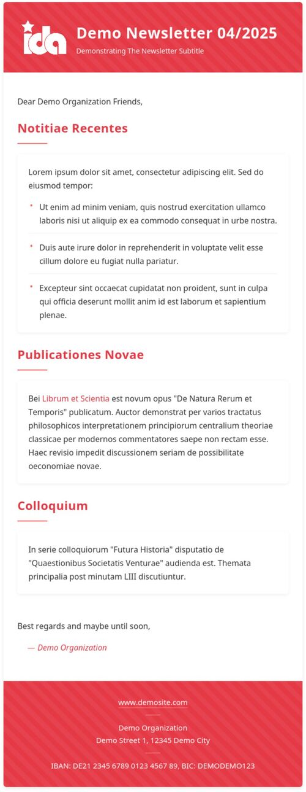

# Newsletter Template

HTML newsletter template tested across common email clients.



## What it does

- Generates HTML newsletter templates
- Uses YAML for content configuration
- Inlines CSS for email client compatibility
- Converts images to base64
- Tests rendering across email clients

## Components

1. **Generator** (`generate.py`):
   - Processes templates with content from YAML
   - Inlines CSS using premailer
   - Handles image conversion

2. **Testing** (`tests/run_tests.py`):
   - Tests against multiple email clients
   - Tracks results by git commit
   - Generates YAML reports

## Usage

```bash
# Install dependencies
pip install -r requirements.txt

# Generate newsletter
python generate.py

# Test across clients
python tests/run_tests.py
```

## Configuration

- `newsletter_data.yaml`: Newsletter content
- `tests/clients.yaml`: Email clients for testing
- `tests/testcases.yaml`: Test cases

## Requirements

- Python 3.x
- Dependencies: premailer, pyyaml

## License

MIT

## Test Results

Latest test results from 6f8274081269c43f0d5d1b68939be6cbe1809f8c:

| Client | Test Result |
|--------|-------------|
| gmail-browserclient | ✓ |
| gmail-androidapp | ✓ |
| gmx-browserclient | ✓ |
| gmx-androidapp | ✓ |
| thunderbird-ubuntu | ✓ |
| riseup-browserclient | ✓ |
| systemli-browserclient | ✓ |
| firefox-ubuntu-desktopscreen | ✓ |
| firefox-ubuntu-mobilescreen | ✓ |
| applemail-iosapp | ✓ |
| outlook-iosapp | ✓ |
| outlook365-browserclient | ✓ |
| outlook365-windows | ✓ |
